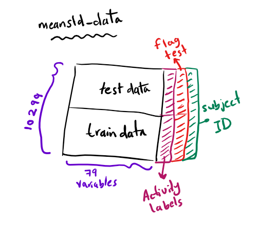

To merege **train data** and **test data**, i stacked them ontop of each other (row binding) and called it `totalData`. 
For the subset of data that contains mean and std measures, i stored it in `meanStd_data` variable and added a 3 more variable (columns):

* `testFlag` to differentiate test data from train data. 
* `activity` for activity names, and 
* `subjectID` to specify the subject id for each observation.



# Reading data
```{r, message=FALSE, warning=FALSE}
library(data.table)
# Read the feature names and activity labels
featureNames <- read.table("./UCI HAR Dataset/features.txt")
activityNames <- read.table("./UCI HAR Dataset/activity_labels.txt")
```


```{r}
# Reading the test and train sets
testdata <- read.table("./UCI HAR Dataset/test/X_test.txt")
testlabels <- read.table("./UCI HAR Dataset/test/y_test.txt")
testsubject <- read.table("./UCI HAR Dataset/test/subject_test.txt")

traindata <- read.table("./UCI HAR Dataset/train/X_train.txt")
trainlabels <- read.table("./UCI HAR Dataset/train/y_train.txt")
trainsubject <- read.table("./UCI HAR Dataset/train/subject_train.txt")
```


# Merging (part 1)

```{r}
## get dimensions
testDim <- dim(testdata)
trainDim <- dim(traindata)
```

Combine the `testdata` and `traindata` tables. Then, add the `subjectID`
```{r}
totalData <- rbind(testdata,traindata)
```

Check the dimensions of the final big dataset `totalData`.
```{r}
##
dim(totalData)
```


# Extract the mean and std (part 2) 
First, search the variable names `featureNames` for any variable with **mean** or **std** in its name, get their idicies, store them into `varInd` means **variable indicies**. Store the number of the extracted columns in `numExtractedVariables` to be used.
```{r}
## get varInd
varInd <- grep("mean\\(\\)|std\\(\\)", featureNames[,2])
numExtractedVariables <- length(varInd)

## check the variables names
featureNames[varInd,2]
```


Then, Extract the corresponding measurements from the merged table `totalData`. Store the output in `meanStd_data`.
```{r}
meanStd_data <- totalData[,varInd]
head(meanStd_data)
```

Combine subject variable from test data and training data into one column `subjectID`.
```{r}
subjectID <- data.table(rbind(testsubject, trainsubject))
dim(subjectID)
```


Create `testFlag` variable which is `TRUE` if the observation is from the `testdata` and `FALSE` otherwise.
```{r}
##
testFlag <- data.table(rep(c(T,F), c(testDim[1],trainDim[1])))

dim(testFlag)
```

Combine `subjectID` and `testFlag` variables to `meanStd_data`
```{r}
meanStd_data <- cbind(meanStd_data, setnames(subjectID,c('subjectID')), setnames(testFlag,c('testFlag')))

## check the dimensions for the meanStd_data
dim(meanStd_data)
```

# Name the activities part(3) 
change the activity names from [1,2,3,4,5,6] to [WALKING,WALKING_UPSTAIRS,WALKING_DOWNSTAIRS, SITTING,STANDING,LAYING] which are stored in `activityNames` datatable.

Create a function `replaceNumberWithName` that replace **activity number** with **activity names**. Then apply it on the `testlabels` and the `trainlabels`. The output is stored in `testlabels_names`, and `trainlabels_names`.
```{r}
## the used function
replaceNumberWithName <- function(x){activityNames[x,2]}

## replace number with names for test data
testlabels_names <- sapply(testlabels,replaceNumberWithName)

## replace number with names for train data
trainlabels_names <- sapply(trainlabels,replaceNumberWithName)
```

Then, conmbine activity labels `testlabels_names`, and `trainlabels_names` into a single column `combinedactivity`.
```{r}
combinedactivity <- data.table(rbind(testlabels_names, trainlabels_names))
```


finally, add the label variable to the `meanStd_data`

```{r}
meanStd_data <- cbind(meanStd_data, setnames(combinedactivity,c('activity')))

## check meanStd_data dimensions
dim(meanStd_data)

## Check the new names
names(meanStd_data)
```


# label the data set with descriptive variable names (part 4) 
Replacing the old variable names `V1, V2, ... V561` with the variable names given with the dataset stored in `featureNames`.

```{r}
## old column names
names(meanStd_data)

## set the new names. VarInd from step #2
setnames(meanStd_data,colnames(meanStd_data)[1:numExtractedVariables],as.character(featureNames$V2[varInd]))

## new column names
names(meanStd_data)
```

# Tidy dataset (part 5) 
First, take a look at the `trainsubject` and `testsubject` data. 
```{r}
table(trainsubject)
table(testsubject)
```

We have a total of 30 subjects. Subject number [2,4,9,10,12,13,18,20,24] are in the `testset` and the others are in the `trainset`. 

To create a new tidy data i used `aggregate` to calculate the `mean` for each measurement grouped by `subjectID` and `activity`. The final dataset `TidyData` has dimensions of **[180x563]**. The output variables (columns) are `id` for subject id, `activity`, `testFlag`, and the 561 measurements. 

Save the `TidyData` as a `.txt` file.

```{r}
TidyData <- aggregate(meanStd_data[,1:numExtractedVariables], by=list("id"=meanStd_data$subjectID, "activity" = meanStd_data$activity), mean)

## check tidyData dimension
dim(TidyData)

write.table(TidyData,"TidyData.txt", row.names = F)
```

