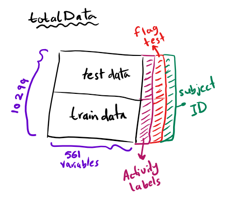

-   [Reading data](#reading-data)
-   [Merging (part 1)](#merging-part-1)
-   [Extract the mean and std (part 2)](#extract-the-mean-and-std-part-2)
-   [Name the activities part(3)](#name-the-activities-part3)
-   [label the data set with descriptive variable names (part 4)](#label-the-data-set-with-descriptive-variable-names-part-4)
-   [Tidy dataset (part 5)](#tidy-dataset-part-5)

To merege **train data** and **test data**, i stacked them ontop of each other (row binding) and called it `totalData`. For the subset of data that contains mean and std measures, i stored it in `meanStd_data` variable and added a 3 more variable (columns):

-   `testFlag` to differentiate test data from train data.
-   `activity` for activity names, and
-   `subjectID` to specify the subject id for each observation.



Reading data
============

``` r
library(data.table)
# Read the feature names and activity labels
featureNames <- read.table("./UCI HAR Dataset/features.txt")
activityNames <- read.table("./UCI HAR Dataset/activity_labels.txt")
```

``` r
# Reading the test and train sets
testdata <- read.table("./UCI HAR Dataset/test/X_test.txt")
testlabels <- read.table("./UCI HAR Dataset/test/y_test.txt")
testsubject <- read.table("./UCI HAR Dataset/test/subject_test.txt")

traindata <- read.table("./UCI HAR Dataset/train/X_train.txt")
trainlabels <- read.table("./UCI HAR Dataset/train/y_train.txt")
trainsubject <- read.table("./UCI HAR Dataset/train/subject_train.txt")
```

Merging (part 1)
================

``` r
## get dimensions
testDim <- dim(testdata)
trainDim <- dim(traindata)
```

Combine the `testdata` and `traindata` tables. Then, add the `subjectID`

``` r
totalData <- rbind(testdata,traindata)
```

Check the dimensions of the final big dataset `totalData`.

``` r
##
dim(totalData)
```

    ## [1] 10299   561

Extract the mean and std (part 2)
=================================

First, search the variable names `featureNames` for any variable with **mean** or **std** in its name, get their idicies, store them into `varInd` means **variable indicies**. Store the number of the extracted columns in `numExtractedVariables` to be used.

``` r
## get varInd
varInd <- grep("mean|std", featureNames[,2])
numExtractedVariables <- length(varInd)

## check the variables names
featureNames[varInd,2]
```

    ##  [1] tBodyAcc-mean()-X               tBodyAcc-mean()-Y              
    ##  [3] tBodyAcc-mean()-Z               tBodyAcc-std()-X               
    ##  [5] tBodyAcc-std()-Y                tBodyAcc-std()-Z               
    ##  [7] tGravityAcc-mean()-X            tGravityAcc-mean()-Y           
    ##  [9] tGravityAcc-mean()-Z            tGravityAcc-std()-X            
    ## [11] tGravityAcc-std()-Y             tGravityAcc-std()-Z            
    ## [13] tBodyAccJerk-mean()-X           tBodyAccJerk-mean()-Y          
    ## [15] tBodyAccJerk-mean()-Z           tBodyAccJerk-std()-X           
    ## [17] tBodyAccJerk-std()-Y            tBodyAccJerk-std()-Z           
    ## [19] tBodyGyro-mean()-X              tBodyGyro-mean()-Y             
    ## [21] tBodyGyro-mean()-Z              tBodyGyro-std()-X              
    ## [23] tBodyGyro-std()-Y               tBodyGyro-std()-Z              
    ## [25] tBodyGyroJerk-mean()-X          tBodyGyroJerk-mean()-Y         
    ## [27] tBodyGyroJerk-mean()-Z          tBodyGyroJerk-std()-X          
    ## [29] tBodyGyroJerk-std()-Y           tBodyGyroJerk-std()-Z          
    ## [31] tBodyAccMag-mean()              tBodyAccMag-std()              
    ## [33] tGravityAccMag-mean()           tGravityAccMag-std()           
    ## [35] tBodyAccJerkMag-mean()          tBodyAccJerkMag-std()          
    ## [37] tBodyGyroMag-mean()             tBodyGyroMag-std()             
    ## [39] tBodyGyroJerkMag-mean()         tBodyGyroJerkMag-std()         
    ## [41] fBodyAcc-mean()-X               fBodyAcc-mean()-Y              
    ## [43] fBodyAcc-mean()-Z               fBodyAcc-std()-X               
    ## [45] fBodyAcc-std()-Y                fBodyAcc-std()-Z               
    ## [47] fBodyAcc-meanFreq()-X           fBodyAcc-meanFreq()-Y          
    ## [49] fBodyAcc-meanFreq()-Z           fBodyAccJerk-mean()-X          
    ## [51] fBodyAccJerk-mean()-Y           fBodyAccJerk-mean()-Z          
    ## [53] fBodyAccJerk-std()-X            fBodyAccJerk-std()-Y           
    ## [55] fBodyAccJerk-std()-Z            fBodyAccJerk-meanFreq()-X      
    ## [57] fBodyAccJerk-meanFreq()-Y       fBodyAccJerk-meanFreq()-Z      
    ## [59] fBodyGyro-mean()-X              fBodyGyro-mean()-Y             
    ## [61] fBodyGyro-mean()-Z              fBodyGyro-std()-X              
    ## [63] fBodyGyro-std()-Y               fBodyGyro-std()-Z              
    ## [65] fBodyGyro-meanFreq()-X          fBodyGyro-meanFreq()-Y         
    ## [67] fBodyGyro-meanFreq()-Z          fBodyAccMag-mean()             
    ## [69] fBodyAccMag-std()               fBodyAccMag-meanFreq()         
    ## [71] fBodyBodyAccJerkMag-mean()      fBodyBodyAccJerkMag-std()      
    ## [73] fBodyBodyAccJerkMag-meanFreq()  fBodyBodyGyroMag-mean()        
    ## [75] fBodyBodyGyroMag-std()          fBodyBodyGyroMag-meanFreq()    
    ## [77] fBodyBodyGyroJerkMag-mean()     fBodyBodyGyroJerkMag-std()     
    ## [79] fBodyBodyGyroJerkMag-meanFreq()
    ## 477 Levels: angle(tBodyAccJerkMean),gravityMean) ...

Then, Extract the corresponding measurements from the merged table `totalData`. Store the output in `meanStd_data`.

``` r
meanStd_data <- totalData[,varInd]
head(meanStd_data)
```

    ##          V1          V2          V3         V4         V5         V6
    ## 1 0.2571778 -0.02328523 -0.01465376 -0.9384040 -0.9200908 -0.6676833
    ## 2 0.2860267 -0.01316336 -0.11908252 -0.9754147 -0.9674579 -0.9449582
    ## 3 0.2754848 -0.02605042 -0.11815167 -0.9938190 -0.9699255 -0.9627480
    ## 4 0.2702982 -0.03261387 -0.11752018 -0.9947428 -0.9732676 -0.9670907
    ## 5 0.2748330 -0.02784779 -0.12952716 -0.9938525 -0.9674455 -0.9782950
    ## 6 0.2792199 -0.01862040 -0.11390197 -0.9944552 -0.9704169 -0.9653163
    ##         V41        V42       V43        V44        V45        V46
    ## 1 0.9364893 -0.2827192 0.1152882 -0.9254273 -0.9370141 -0.5642884
    ## 2 0.9274036 -0.2892151 0.1525683 -0.9890571 -0.9838872 -0.9647811
    ## 3 0.9299150 -0.2875128 0.1460856 -0.9959365 -0.9882505 -0.9815796
    ## 4 0.9288814 -0.2933958 0.1429259 -0.9931392 -0.9704192 -0.9915917
    ## 5 0.9265997 -0.3029609 0.1383067 -0.9955746 -0.9709604 -0.9680853
    ## 6 0.9256632 -0.3089397 0.1305608 -0.9988423 -0.9907387 -0.9712319
    ##          V81          V82          V83        V84        V85        V86
    ## 1 0.07204601  0.045754401 -0.106042660 -0.9066828 -0.9380164 -0.9359358
    ## 2 0.07018069 -0.017876016 -0.001720629 -0.9492040 -0.9726989 -0.9777267
    ## 3 0.06936778 -0.004908146 -0.013672983 -0.9910699 -0.9714041 -0.9728674
    ## 4 0.07485289  0.032274322  0.012141275 -0.9908016 -0.9728957 -0.9759253
    ## 5 0.07837679  0.022276764  0.002748499 -0.9920724 -0.9786700 -0.9866120
    ## 6 0.07598039  0.017519217  0.008208061 -0.9938344 -0.9791029 -0.9876064
    ##           V121        V122       V123       V124       V125       V126
    ## 1  0.119976160 -0.09179234 0.18962854 -0.8830891 -0.8161636 -0.9408812
    ## 2 -0.001552463 -0.18729119 0.18070522 -0.9255665 -0.9295992 -0.9675810
    ## 3 -0.048212671 -0.16627974 0.15417437 -0.9729882 -0.9785106 -0.9756483
    ## 4 -0.056641577 -0.12601846 0.11833718 -0.9677905 -0.9751338 -0.9632327
    ## 5 -0.059992128 -0.08472343 0.07865926 -0.9746560 -0.9779511 -0.9676287
    ## 6 -0.039697949 -0.06682849 0.07054732 -0.9798784 -0.9764628 -0.9634617
    ##          V161        V162        V163       V164       V165       V166
    ## 1 -0.20489621 -0.17448771 -0.09338934 -0.9012242 -0.9108601 -0.9392504
    ## 2 -0.13866849 -0.02580207 -0.07141841 -0.9623042 -0.9562894 -0.9813408
    ## 3 -0.09780967 -0.03421327 -0.06002840 -0.9841669 -0.9879399 -0.9761876
    ## 4 -0.10223178 -0.04471346 -0.05343650 -0.9841709 -0.9895542 -0.9807240
    ## 5 -0.09184994 -0.02900502 -0.06123535 -0.9884738 -0.9918773 -0.9819836
    ## 6 -0.09273955 -0.03213821 -0.07257549 -0.9894167 -0.9894940 -0.9777794
    ##         V201       V202       V214       V215       V227       V228
    ## 1 -0.8669294 -0.7051911 -0.8669294 -0.7051911 -0.9297665 -0.8959942
    ## 2 -0.9689614 -0.9539024 -0.9689614 -0.9539024 -0.9737168 -0.9410078
    ## 3 -0.9762282 -0.9790834 -0.9762282 -0.9790834 -0.9816177 -0.9713710
    ## 4 -0.9743245 -0.9770159 -0.9743245 -0.9770159 -0.9827121 -0.9748075
    ## 5 -0.9758356 -0.9768934 -0.9758356 -0.9768934 -0.9869079 -0.9888539
    ## 6 -0.9817163 -0.9777039 -0.9817163 -0.9777039 -0.9873357 -0.9919970
    ##         V240       V241       V253       V254       V266       V267
    ## 1 -0.7955439 -0.7620732 -0.9251949 -0.8943436 -0.9185097 -0.9182132
    ## 2 -0.8984331 -0.9108583 -0.9733934 -0.9440900 -0.9609030 -0.9644333
    ## 3 -0.9391936 -0.9717763 -0.9867480 -0.9844015 -0.9919063 -0.9650336
    ## 4 -0.9471844 -0.9703682 -0.9888204 -0.9855681 -0.9930298 -0.9682839
    ## 5 -0.9574192 -0.9694995 -0.9900621 -0.9904189 -0.9924042 -0.9692072
    ## 6 -0.9697442 -0.9732947 -0.9878482 -0.9890428 -0.9938427 -0.9707293
    ##         V268       V269       V270       V271        V294         V295
    ## 1 -0.7890915 -0.9482903 -0.9251369 -0.6363167  0.01111695  0.121250690
    ## 2 -0.9566748 -0.9843500 -0.9701748 -0.9418619  0.35206637  0.174546760
    ## 3 -0.9668996 -0.9947537 -0.9736959 -0.9622866  0.18043767  0.133458310
    ## 4 -0.9669116 -0.9955936 -0.9769176 -0.9689579  0.06270005  0.261719750
    ## 5 -0.9796527 -0.9945037 -0.9674681 -0.9782399 -0.01890990 -0.009980057
    ## 6 -0.9755771 -0.9946471 -0.9710160 -0.9614438 -0.17797819 -0.122556470
    ##          V296       V345       V346       V347       V348       V349
    ## 1 -0.52294869 -0.8996332 -0.9374850 -0.9235514 -0.9244291 -0.9432104
    ## 2 -0.32067339 -0.9435190 -0.9691623 -0.9734489 -0.9616312 -0.9800263
    ## 3  0.18265917 -0.9910295 -0.9733689 -0.9717030 -0.9919122 -0.9709857
    ## 4  0.15182490 -0.9905362 -0.9724525 -0.9703374 -0.9919600 -0.9754341
    ## 5  0.09521546 -0.9914800 -0.9798346 -0.9834930 -0.9935709 -0.9786966
    ## 6 -0.12332551 -0.9937759 -0.9789845 -0.9860986 -0.9944514 -0.9807585
    ##         V350       V373        V374        V375       V424       V425
    ## 1 -0.9478915 0.45100539  0.13716703 -0.18029913 -0.8235579 -0.8079160
    ## 2 -0.9807873 0.47285157  0.16719768 -0.24311457 -0.9225130 -0.9264957
    ## 3 -0.9723222 0.27074412 -0.27224472 -0.08249234 -0.9728456 -0.9808333
    ## 4 -0.9806211 0.27733393 -0.03832647  0.02181301 -0.9715016 -0.9813450
    ## 5 -0.9885033 0.18027241 -0.13916163  0.10085294 -0.9764045 -0.9804043
    ## 6 -0.9875569 0.07917486 -0.35372787 -0.11027662 -0.9797034 -0.9805261
    ##         V426       V427       V428       V429        V452        V453
    ## 1 -0.9179126 -0.9032627 -0.8226770 -0.9561651  0.18403457 -0.05932286
    ## 2 -0.9682295 -0.9270506 -0.9320107 -0.9701434  0.01810862 -0.22726634
    ## 3 -0.9720602 -0.9731979 -0.9771945 -0.9790953 -0.47914475 -0.21008368
    ## 4 -0.9667055 -0.9671856 -0.9719094 -0.9652755 -0.49695391 -0.49990580
    ## 5 -0.9687820 -0.9743979 -0.9765654 -0.9700165 -0.42750236 -0.27813128
    ## 6 -0.9602064 -0.9800146 -0.9742469 -0.9678163 -0.32012497 -0.33338449
    ##          V454       V503       V504        V513       V516       V517
    ## 1  0.43810716 -0.7909464 -0.7110740 -0.48345254 -0.8950612 -0.8963596
    ## 2 -0.15169839 -0.9541266 -0.9597458  0.20346524 -0.9454372 -0.9341520
    ## 3  0.04930984 -0.9756497 -0.9837843  0.34245571 -0.9710690 -0.9703078
    ## 4 -0.25889610 -0.9733931 -0.9821196  0.33120550 -0.9716545 -0.9784844
    ## 5 -0.29130830 -0.9777390 -0.9788381  0.07111154 -0.9874888 -0.9897160
    ## 6 -0.05054079 -0.9780025 -0.9798756 -0.04345482 -0.9912947 -0.9917440
    ##          V526       V529       V530        V539       V542       V543
    ## 1 -0.03535579 -0.7706100 -0.7971128 -0.04739130 -0.8901655 -0.9073076
    ## 2 -0.49121253 -0.9244608 -0.9167741 -0.03147392 -0.9519774 -0.9382124
    ## 3  0.14072902 -0.9752095 -0.9739984 -0.16880542 -0.9856888 -0.9832727
    ## 4  0.14864853 -0.9762973 -0.9712482 -0.28563574 -0.9855619 -0.9858429
    ## 5  0.42224872 -0.9770070 -0.9696193 -0.34906064 -0.9904980 -0.9905719
    ## 6  0.40441535 -0.9770345 -0.9750513 -0.17703141 -0.9887326 -0.9898050
    ##          V552
    ## 1  0.07164545
    ## 2 -0.40118872
    ## 3  0.06289131
    ## 4  0.11669529
    ## 5 -0.12171128
    ## 6  0.08360294

Combine subject variable from test data and training data into one column `subjectID`.

``` r
subjectID <- data.table(rbind(testsubject, trainsubject))
dim(subjectID)
```

    ## [1] 10299     1

Create `testFlag` variable which is `TRUE` if the observation is from the `testdata` and `FALSE` otherwise.

``` r
##
testFlag <- data.table(rep(c(T,F), c(testDim[1],trainDim[1])))

dim(testFlag)
```

    ## [1] 10299     1

Combine `subjectID` and `testFlag` variables to `meanStd_data`

``` r
meanStd_data <- cbind(meanStd_data, setnames(subjectID,c('subjectID')), setnames(testFlag,c('testFlag')))

## check the dimensions for the meanStd_data
dim(meanStd_data)
```

    ## [1] 10299    81

Name the activities part(3)
===========================

change the activity names from \[1,2,3,4,5,6\] to \[WALKING,WALKING\_UPSTAIRS,WALKING\_DOWNSTAIRS, SITTING,STANDING,LAYING\] which are stored in `activityNames` datatable.

Create a function `replaceNumberWithName` that replace **activity number** with **activity names**. Then apply it on the `testlabels` and the `trainlabels`. The output is stored in `testlabels_names`, and `trainlabels_names`.

``` r
## the used function
replaceNumberWithName <- function(x){activityNames[x,2]}

## replace number with names for test data
testlabels_names <- sapply(testlabels,replaceNumberWithName)

## replace number with names for train data
trainlabels_names <- sapply(trainlabels,replaceNumberWithName)
```

Then, conmbine activity labels `testlabels_names`, and `trainlabels_names` into a single column `combinedactivity`.

``` r
combinedactivity <- data.table(rbind(testlabels_names, trainlabels_names))
```

finally, add the label variable to the `meanStd_data`

``` r
meanStd_data <- cbind(meanStd_data, setnames(combinedactivity,c('activity')))

## check meanStd_data dimensions
dim(meanStd_data)
```

    ## [1] 10299    82

``` r
## Check the new names
names(meanStd_data)
```

    ##  [1] "V1"        "V2"        "V3"        "V4"        "V5"       
    ##  [6] "V6"        "V41"       "V42"       "V43"       "V44"      
    ## [11] "V45"       "V46"       "V81"       "V82"       "V83"      
    ## [16] "V84"       "V85"       "V86"       "V121"      "V122"     
    ## [21] "V123"      "V124"      "V125"      "V126"      "V161"     
    ## [26] "V162"      "V163"      "V164"      "V165"      "V166"     
    ## [31] "V201"      "V202"      "V214"      "V215"      "V227"     
    ## [36] "V228"      "V240"      "V241"      "V253"      "V254"     
    ## [41] "V266"      "V267"      "V268"      "V269"      "V270"     
    ## [46] "V271"      "V294"      "V295"      "V296"      "V345"     
    ## [51] "V346"      "V347"      "V348"      "V349"      "V350"     
    ## [56] "V373"      "V374"      "V375"      "V424"      "V425"     
    ## [61] "V426"      "V427"      "V428"      "V429"      "V452"     
    ## [66] "V453"      "V454"      "V503"      "V504"      "V513"     
    ## [71] "V516"      "V517"      "V526"      "V529"      "V530"     
    ## [76] "V539"      "V542"      "V543"      "V552"      "subjectID"
    ## [81] "testFlag"  "activity"

label the data set with descriptive variable names (part 4)
===========================================================

Replacing the old variable names `V1, V2, ... V561` with the variable names given with the dataset stored in `featureNames`.

``` r
## old column names
names(meanStd_data)
```

    ##  [1] "V1"        "V2"        "V3"        "V4"        "V5"       
    ##  [6] "V6"        "V41"       "V42"       "V43"       "V44"      
    ## [11] "V45"       "V46"       "V81"       "V82"       "V83"      
    ## [16] "V84"       "V85"       "V86"       "V121"      "V122"     
    ## [21] "V123"      "V124"      "V125"      "V126"      "V161"     
    ## [26] "V162"      "V163"      "V164"      "V165"      "V166"     
    ## [31] "V201"      "V202"      "V214"      "V215"      "V227"     
    ## [36] "V228"      "V240"      "V241"      "V253"      "V254"     
    ## [41] "V266"      "V267"      "V268"      "V269"      "V270"     
    ## [46] "V271"      "V294"      "V295"      "V296"      "V345"     
    ## [51] "V346"      "V347"      "V348"      "V349"      "V350"     
    ## [56] "V373"      "V374"      "V375"      "V424"      "V425"     
    ## [61] "V426"      "V427"      "V428"      "V429"      "V452"     
    ## [66] "V453"      "V454"      "V503"      "V504"      "V513"     
    ## [71] "V516"      "V517"      "V526"      "V529"      "V530"     
    ## [76] "V539"      "V542"      "V543"      "V552"      "subjectID"
    ## [81] "testFlag"  "activity"

``` r
## set the new names. VarInd from step #2
setnames(meanStd_data,colnames(meanStd_data)[1:numExtractedVariables],as.character(featureNames$V2[varInd]))

## new column names
names(meanStd_data)
```

    ##  [1] "tBodyAcc-mean()-X"               "tBodyAcc-mean()-Y"              
    ##  [3] "tBodyAcc-mean()-Z"               "tBodyAcc-std()-X"               
    ##  [5] "tBodyAcc-std()-Y"                "tBodyAcc-std()-Z"               
    ##  [7] "tGravityAcc-mean()-X"            "tGravityAcc-mean()-Y"           
    ##  [9] "tGravityAcc-mean()-Z"            "tGravityAcc-std()-X"            
    ## [11] "tGravityAcc-std()-Y"             "tGravityAcc-std()-Z"            
    ## [13] "tBodyAccJerk-mean()-X"           "tBodyAccJerk-mean()-Y"          
    ## [15] "tBodyAccJerk-mean()-Z"           "tBodyAccJerk-std()-X"           
    ## [17] "tBodyAccJerk-std()-Y"            "tBodyAccJerk-std()-Z"           
    ## [19] "tBodyGyro-mean()-X"              "tBodyGyro-mean()-Y"             
    ## [21] "tBodyGyro-mean()-Z"              "tBodyGyro-std()-X"              
    ## [23] "tBodyGyro-std()-Y"               "tBodyGyro-std()-Z"              
    ## [25] "tBodyGyroJerk-mean()-X"          "tBodyGyroJerk-mean()-Y"         
    ## [27] "tBodyGyroJerk-mean()-Z"          "tBodyGyroJerk-std()-X"          
    ## [29] "tBodyGyroJerk-std()-Y"           "tBodyGyroJerk-std()-Z"          
    ## [31] "tBodyAccMag-mean()"              "tBodyAccMag-std()"              
    ## [33] "tGravityAccMag-mean()"           "tGravityAccMag-std()"           
    ## [35] "tBodyAccJerkMag-mean()"          "tBodyAccJerkMag-std()"          
    ## [37] "tBodyGyroMag-mean()"             "tBodyGyroMag-std()"             
    ## [39] "tBodyGyroJerkMag-mean()"         "tBodyGyroJerkMag-std()"         
    ## [41] "fBodyAcc-mean()-X"               "fBodyAcc-mean()-Y"              
    ## [43] "fBodyAcc-mean()-Z"               "fBodyAcc-std()-X"               
    ## [45] "fBodyAcc-std()-Y"                "fBodyAcc-std()-Z"               
    ## [47] "fBodyAcc-meanFreq()-X"           "fBodyAcc-meanFreq()-Y"          
    ## [49] "fBodyAcc-meanFreq()-Z"           "fBodyAccJerk-mean()-X"          
    ## [51] "fBodyAccJerk-mean()-Y"           "fBodyAccJerk-mean()-Z"          
    ## [53] "fBodyAccJerk-std()-X"            "fBodyAccJerk-std()-Y"           
    ## [55] "fBodyAccJerk-std()-Z"            "fBodyAccJerk-meanFreq()-X"      
    ## [57] "fBodyAccJerk-meanFreq()-Y"       "fBodyAccJerk-meanFreq()-Z"      
    ## [59] "fBodyGyro-mean()-X"              "fBodyGyro-mean()-Y"             
    ## [61] "fBodyGyro-mean()-Z"              "fBodyGyro-std()-X"              
    ## [63] "fBodyGyro-std()-Y"               "fBodyGyro-std()-Z"              
    ## [65] "fBodyGyro-meanFreq()-X"          "fBodyGyro-meanFreq()-Y"         
    ## [67] "fBodyGyro-meanFreq()-Z"          "fBodyAccMag-mean()"             
    ## [69] "fBodyAccMag-std()"               "fBodyAccMag-meanFreq()"         
    ## [71] "fBodyBodyAccJerkMag-mean()"      "fBodyBodyAccJerkMag-std()"      
    ## [73] "fBodyBodyAccJerkMag-meanFreq()"  "fBodyBodyGyroMag-mean()"        
    ## [75] "fBodyBodyGyroMag-std()"          "fBodyBodyGyroMag-meanFreq()"    
    ## [77] "fBodyBodyGyroJerkMag-mean()"     "fBodyBodyGyroJerkMag-std()"     
    ## [79] "fBodyBodyGyroJerkMag-meanFreq()" "subjectID"                      
    ## [81] "testFlag"                        "activity"

Tidy dataset (part 5)
=====================

First, take a look at the `trainsubject` and `testsubject` data.

``` r
table(trainsubject)
```

    ## trainsubject
    ##   1   3   5   6   7   8  11  14  15  16  17  19  21  22  23  25  26  27 
    ## 347 341 302 325 308 281 316 323 328 366 368 360 408 321 372 409 392 376 
    ##  28  29  30 
    ## 382 344 383

``` r
table(testsubject)
```

    ## testsubject
    ##   2   4   9  10  12  13  18  20  24 
    ## 302 317 288 294 320 327 364 354 381

We have a total of 30 subjects. Subject number \[2,4,9,10,12,13,18,20,24\] are in the `testset` and the others are in the `trainset`.

To create a new tidy data i used `aggregate` to calculate the `mean` for each measurement grouped by `subjectID` and `activity`. The final dataset `TidyData` has dimensions of **\[180x563\]**. The output variables (columns) are `id` for subject id, `activity`, `testFlag`, and the 561 measurements.

Save the `TidyData` as a `.txt` file.

``` r
TidyData <- aggregate(meanStd_data[,1:numExtractedVariables], by=list("id"=meanStd_data$subjectID, "activity" = meanStd_data$activity), mean)

## check tidyData dimension
dim(TidyData)
```

    ## [1] 180  81

``` r
write.table(TidyData,"TidyData.txt", row.names = F)
```
